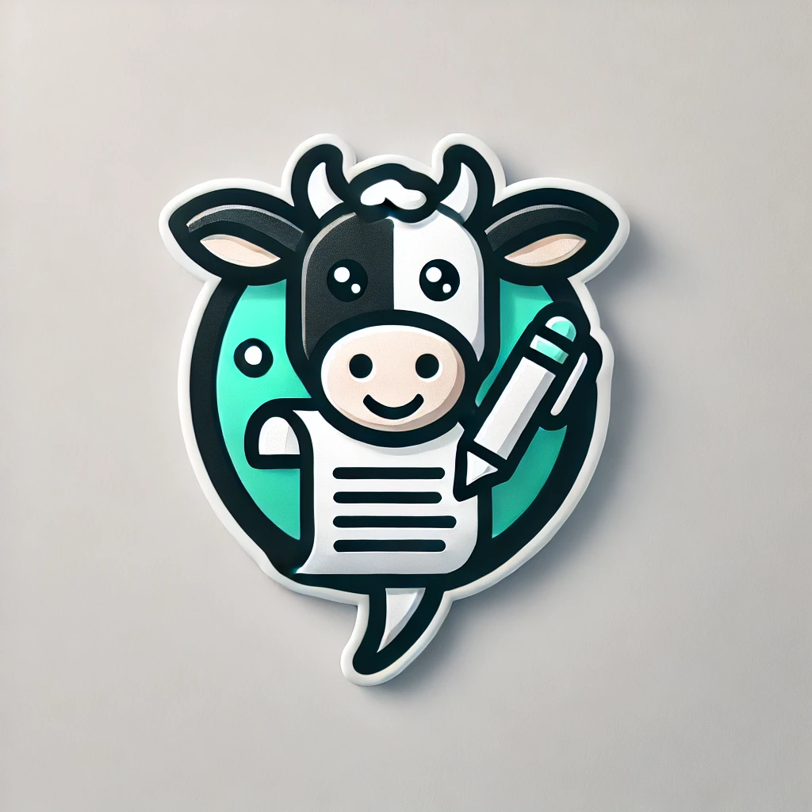
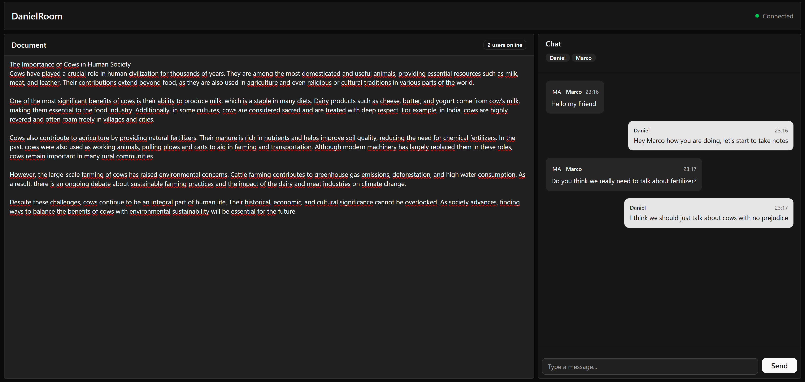

# COWRITY - V0.0.2

> _Document editing reimagined. Collaboration redefined._

## ⚡ REAL-TIME COLLABORATION REDEFINED ⚡

Cowrity brings your team together in a seamless editing experience where ideas flow freely. Edit together. Chat together. Create together.

---

### 🔥 STANDOUT FEATURES 🔥

- **LIVE EDITING** 👥 | See keystrokes as they happen
- **CHAT INTEGRATION** 💬 | Communication without context switching
- **INSTANT SYNC** ⚡ | Zero latency. Zero waiting.
- **SLICK INTERFACE** 🎨 | Beautiful. Intuitive. Powerful.
- **PRESENCE AWARENESS** 👁️ | Know who's where, doing what

---

### 🛠️ CUTTING-EDGE TECH 🛠️

Built with next-gen technologies:

- WebSockets | Socket.IO | React
- OT Algorithms | Redux | Node.js
- Tailwind | MongoDB | JWT Auth

---

## 🚀 WHERE COLLABORATION MEETS INNOVATION 🚀

  <em>Cowrity. The steaks are high, but our docs are well-done.</em> 🥩

## 📸 SHOWCASE 📸

  
  
<em>Real-time collaborative editing with integrated chat</em>

  

